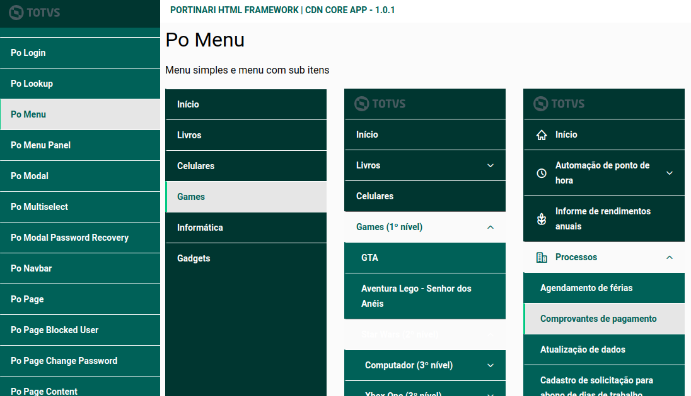

# GEBittencourt Portinari Style Green

This is a Portinari Theme with Green tonalities to [Portinari UI](https://github.com/portinariui/portinari-angular).

## How to use

* Install this package:
    ```
    npm install @gebittencourt/portinari-style-green
    ```

* Include in `angular.json` this style:
    ```json
    "styles": [
        "./node_modules/@gebittencourt/portinari-style-green/css/po-theme-default.min.css"
    ],
    ```

## Sample


